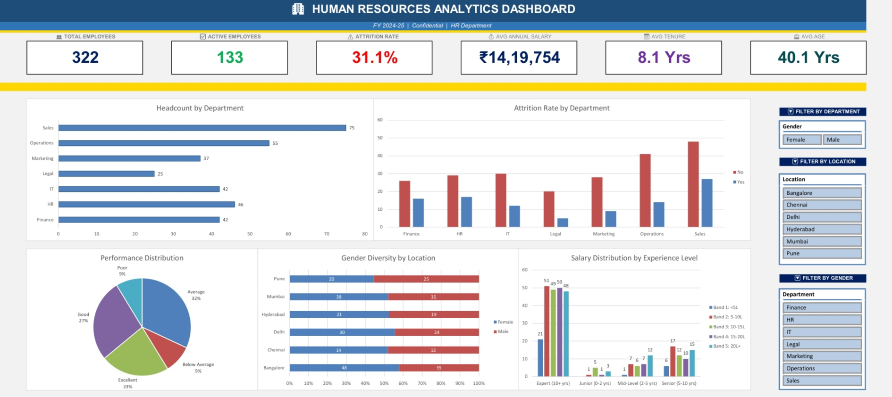

# 🏢 HR Analytics Excel Dashboard

An end-to-end HR Analytics project built entirely in Microsoft Excel.

## 📸 Dashboard Preview

## 📊 Project Overview
This project takes a raw, messy HR dataset of 500+ employee records and transforms it 
into a fully interactive executive dashboard.

## 🔧 What Was Done
- **Data Cleaning** — Removed duplicates, fixed inconsistent formats, handled invalid values
- **Data Transformation** — Added 6 calculated columns (Tenure, Age Group, Salary Band, etc.)
- **Advanced Formulas** — COUNTIFS, AVERAGEIFS, SUMIFS, DATEDIF, IFS, IFERROR
- **Pivot Tables** — 5 pivot tables answering key HR business questions
- **Charts** — 5 professional charts linked to pivot tables
- **Interactive Dashboard** — KPI cards + slicers for Department, Location & Gender filtering

## 📁 File Structure
| Sheet | Description |
|-------|-------------|
| HR_DASHBOARD | 🎯 Main interactive dashboard |
| RAW_DATA | Original uncleaned dataset (protected) |
| WORKING_DATA | Cleaned & transformed data (30 columns) |
| HR_SUMMARY | Formula-based summary statistics |
| PIVOT_TABLES | 5 pivot tables for analysis |
| CHARTS | 5 linked charts |
| DATA_DICTIONARY | Column descriptions and data notes |

## 📈 Key Insights from the Data
- Total Employees: 322
- Attrition Rate: 31.1% — highest in Sales department
- Average Salary: ₹14,19,754
- Average Tenure: 8.1 Years
- Gender Split: 53% Female / 47% Male
- Top performing department by headcount: Sales (75 employees)

## 🛠️ Tools Used
- Microsoft Excel (Pivot Tables, Slicers, Advanced Formulas, Charts)

## 👤 Author
*Dhammadeep Ramteke*  
*LinkedIn: https://www.linkedin.com/in/dhammadeep-ramteke/*
