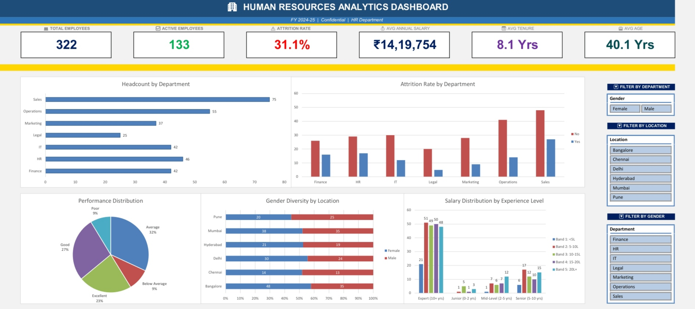

# 🏢 HR Analytics Excel Dashboard

> An end-to-end HR analytics project built entirely in Microsoft Excel — from a messy raw dataset to a fully interactive executive dashboard.

---

## 1. 📌 Problem Statement

Organizations often struggle to understand why employees leave, which departments are underperforming, and how salary and performance are distributed across the workforce. Without a clear view of HR data, decisions about hiring, retention, and compensation are made on guesswork.

This project addresses that gap by turning a raw, unclean HR dataset into a structured and visual analytics dashboard that gives HR teams and leadership actionable answers.

---

## 2. 🎯 Project Objective

The goal of this project is to:

- Clean and standardize a messy HR dataset of 500+ employee records
- Build calculated metrics like Tenure, Age Group, and Salary Band
- Analyze key HR indicators — Attrition, Headcount, Salary, Performance, and Gender Diversity
- Deliver an interactive Excel dashboard that can be filtered by Department, Location, and Gender

---

## 3. 📂 Data Understanding

The dataset contains **500+ employee records** with **20 raw columns**, including:

| Column | Description |
|---|---|
| Employee_ID | Unique employee identifier |
| Department | Department the employee belongs to |
| Location | City of work |
| Gender | Employee gender |
| Age | Employee age |
| Education | Highest qualification |
| Employment_Status | Active / Terminated / On Leave / Contract |
| Joining_Date | Date of joining the organization |
| Experience_Years | Total years of professional experience |
| Annual_Salary | Annual CTC (in ₹) |
| Bonus_Percent | Bonus percentage |
| Performance_Rating | Rating on a 1–5 scale |
| Attrition | Whether the employee left (Yes / No) |
| Overtime_Hours | Hours of overtime worked |
| Training_Hours | Training hours completed |

The raw data had multiple quality issues — inconsistent formatting, missing values, invalid entries, and duplicate records — which required thorough cleaning before analysis.

---

## 4. 🧹 Data Cleaning Process

The raw data was preserved in the `RAW_DATA` sheet (protected). All cleaning was done in the `WORKING_DATA` sheet.

**Issues found and fixed:**

- **Inconsistent Department names** — e.g., `"sales"`, `"SALES"`, `"Sales"` → standardized to `"Sales"`
- **Inconsistent Gender values** — e.g., `"M"`, `"MALE"`, `"male"`, `"Female"`, `"F"` → standardized to `"Male"` / `"Female"`
- **Inconsistent Location names** — e.g., `"Bengaluru"` and `"bangalore"` → standardized to `"Bangalore"`
- **Mixed Attrition values** — e.g., `"yes"`, `"Y"`, `"YES"`, `"No"`, `"NO"`, `"N"` → standardized to `"Yes"` / `"No"`
- **Mixed Employment Status** — e.g., `"ACTIVE"`, `"active"`, `"on leave"` → standardized consistently
- **Invalid Joining Dates** — multiple date formats (`2023-05-13`, `16-7-2021`, `2020/10/28`) → converted to a single format
- **Invalid phone numbers** — entries like `"0000000000"`, `"N/A"` → replaced with blanks
- **Invalid emails** — entries like `"invalid-email"` → flagged or removed
- **Missing Bonus Percent & Performance Rating** — filled or excluded from aggregations
- **Invalid Performance Ratings** — entries like `"N/A"` → treated as null
- **Duplicate employee names** — identified and reviewed (e.g., `"Manish Bose"` appeared twice as separate employees)
- **Name formatting issues** — e.g., `"Desai, Varsha"`, `"TEJAS BHAT"`, `"REKHA SAXENA"` → reformatted to proper case

---

## 5. 📐 Data Modelling

After cleaning, **6 calculated columns** were added to enrich the dataset:

| Column | Formula Logic |
|---|---|
| **Tenure (Years)** | Years between Joining Date and today using `DATEDIF` |
| **Age Group** | Buckets: `<30`, `30–40`, `40–50`, `50+` using `IFS` |
| **Salary Band** | Bands: `<5L`, `5–10L`, `10–15L`, `15–20L`, `20L+` using `IFS` |
| **Experience Level** | Junior / Mid-Level / Senior / Expert based on experience years |
| **Attrition Flag** | Binary `1 / 0` version of Attrition for calculations |
| **Bonus Amount (₹)** | `Annual Salary × Bonus % / 100` |

These columns power all pivot tables, KPI cards, and charts on the dashboard.

---

## 6. 🧮 Key Formulas Used

> Note: This project is built entirely in Excel — it does not use DAX or Power BI. The following are the advanced Excel formulas used.

| Formula | Purpose |
|---|---|
| `COUNTIFS` | Count employees matching multiple conditions (e.g., attrited females in Sales) |
| `AVERAGEIFS` | Average salary or tenure filtered by department / gender |
| `SUMIFS` | Total salary or bonus for specific groups |
| `DATEDIF` | Calculate exact tenure in years from joining date |
| `IFS` | Assign groups like Age Group, Salary Band, Experience Level |
| `IFERROR` | Prevent errors from showing in summary cells |
| `TEXT` | Format dates and numbers cleanly |

All summary statistics are housed in the `HR_SUMMARY` sheet and linked dynamically to the dashboard.

---

## 7. 📊 Dashboard Overview

The `HR_DASHBOARD` sheet is the main interactive view. It contains:

**KPI Cards (Top Row)**

| KPI | Value |
|---|---|
| Total Employees | 322 |
| Active Employees | 133 |
| Attrition Rate | 31.1% |
| Avg Annual Salary | ₹14,19,754 |
| Avg Tenure | 8.1 Years |
| Avg Age | 40.1 Years |

**Charts**

| Chart | Type | What It Shows |
|---|---|---|
| Headcount by Department | Horizontal Bar | Employee count per department |
| Attrition Rate by Department | Clustered Bar | Who stayed vs. who left, per department |
| Performance Distribution | Pie Chart | Share of employees by rating category |
| Gender Diversity by Location | Stacked Bar | Male vs. Female split across cities |
| Salary Distribution by Experience | Grouped Bar | Salary bands across experience levels |

**Interactive Slicers**

- 🔵 Filter by **Department**
- 🟢 Filter by **Location** (Bangalore, Chennai, Delhi, Hyderabad, Mumbai, Pune)
- 🔴 Filter by **Gender**

All charts and KPI cards update automatically when a slicer is applied.

---

## 8. 💡 Key Insights

- **Total workforce:** 322 employees recorded; only 133 are currently active
- **Attrition rate of 31.1%** — this is critically high, especially in **Sales (highest)** and **Operations**
- **Average salary of ₹14,19,754** with notable variation across experience levels and departments
- **Average tenure is 8.1 years**, suggesting a reasonably experienced workforce
- **Gender split is near-equal** — 53% Female, 47% Male — with good representation across most locations
- **Bangalore has the highest headcount** (83 employees), followed by Mumbai (73)
- **23% of employees are rated Excellent**, while 9% are rated Poor — a manageable but watch-worthy gap
- **Expert-level employees (10+ yrs experience)** dominate the higher salary bands (Band 4 & 5)
- **Junior employees (0–2 yrs)** are concentrated in Band 1 (<₹5L), indicating entry-level pay structure is consistent

---

## 9. ✅ Recommendations

1. **Investigate Sales attrition urgently** — with the highest attrition rate in the company, Sales needs targeted retention strategies (better incentives, career growth paths, or workload review)

2. **Review compensation for mid-level employees** — the salary distribution shows a compression between Mid-Level and Senior bands; this could drive experienced employees to leave

3. **Standardize HR data entry** — the volume of inconsistencies (gender labels, department names, date formats) suggests the need for dropdown-based data entry forms or validation rules in Excel/HRMS

4. **Increase training hours for high-attrition departments** — attriting employees had varied training hours; structured L&D programs may improve engagement and retention

5. **Monitor "On Leave" and "Inactive" statuses** — a significant number of employees fall in these categories; they may need re-engagement or formal separation processing

6. **Track performance-to-salary alignment** — some high performers appear in lower salary bands; this misalignment can be a flight risk

---

## 10. 🛠️ Skills Demonstrated

- **Data Cleaning** — Handling inconsistencies, nulls, invalid formats, and duplicates in a raw dataset
- **Data Transformation** — Deriving new analytical columns using Excel formulas
- **Advanced Excel Formulas** — `COUNTIFS`, `AVERAGEIFS`, `SUMIFS`, `DATEDIF`, `IFS`, `IFERROR`
- **Pivot Tables** — Building dynamic summaries across multiple dimensions
- **Data Visualization** — Designing bar, pie, and stacked charts with professional formatting
- **Dashboard Design** — Assembling KPI cards, charts, and slicers into a clean, executive-ready layout
- **Slicer Configuration** — Linking slicers to multiple pivot tables for cross-filtering
- **Analytical Thinking** — Translating raw HR data into business insights and recommendations

---

## 11. 📁 Files in This Repository

| File | Description |
|---|---|
| `HR_Employee_Dataset.xlsx` | Main Excel workbook (all sheets included) |
| `dashboard_preview.png` | Screenshot of the final dashboard |
| `README.md` | Project documentation (this file) |

**Sheet structure inside the Excel file:**

| Sheet | Description |
|---|---|
| `HR_DASHBOARD` | 🎯 Main interactive dashboard with KPIs, charts, and slicers |
| `RAW_DATA` | Original uncleaned dataset (protected — do not edit) |
| `WORKING_DATA` | Cleaned and transformed data with 30 columns |
| `HR_SUMMARY` | Formula-based summary statistics linked to the dashboard |
| `PIVOT_TABLES` | 5 pivot tables powering the dashboard charts |
| `CHARTS` | 5 professional charts linked to pivot tables |
| `DATA_DICTIONARY` | Column descriptions, accepted values, and data notes |

---

## 👤 Author

**Dhammadeep Anil Ramteke**

- 💼 LinkedIn: https://www.linkedin.com/in/dhammadeep-ramteke/
- 🐙 GitHub: https://github.com/DHAMMADEEPRAMTEKE30
- 📧 Email: ramtekedhamma30@gmail.com / dhammadeepramteke2702@gmail.com

---

*Built entirely in Microsoft Excel · FY 2024–25 · HR Department*
